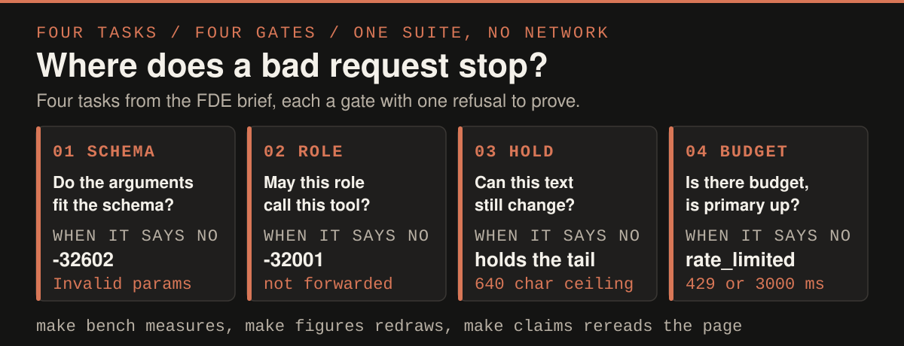

<p align="center">
  
</p>

*Every number on this page comes from a command here, and `make check` fails when a badge or a committed figure drifts from its report.*

# Quilr FDE assessment

<p align="center">
  
  
  
</p>

Four tasks from the brief in one project. The hard one is task 3. A value to redact can arrive split across two chunks of a stream, so the guardrail emits only the text that can no longer change and holds the rest. Bounded patterns cap what it holds at 640 characters, whatever the response is. One test suite covers all four, with no network and no API key.

## Run it

```bash
make install     # uv sync, Python 3.13
make test        # the whole suite, all four tasks
make check       # lint, figure check, claim check, then the suite
make bench       # what the task 3 guardrail costs
make run-task1   # MCP server on stdio
make run-task2   # security gateway on 8080, mock downstream on 8081
make run-task3   # streaming PII guardrail on 8082
make run-task4   # model router demo, prints every routing outcome
```

## What each task owns

<p align="center">
  
</p>

`src/task1_mcp_server` puts two tools on stdio behind one Pydantic model that is both the advertised schema and the runtime check.

`src/task2_mcp_gateway` is a JSON-RPC reverse proxy that decides before it forwards, so a viewer asking for an `admin_` tool never reaches the downstream.

`src/task3_stream_guard` redacts emails, social security numbers and card numbers while the response is still streaming, including a value split across two chunks.

`src/task4_model_router` admits a request against a sliding token budget kept in sqlite, then fails over to a second provider on a 429 or a 3000 ms timeout.

[The four tasks](docs/TASKS.md) has the decision inside each one that is worth arguing about.

## What the guardrail costs

<p align="center">
  
</p>

A reply opening mid pattern waits for that pattern to resolve, and the wait is bounded by the 320 character
longest match. A longer response never costs more.

## What this does not prove

The brief's overview says five tasks and its body stops at four, so this repo has four.

| Number on the page | What it does not cover |
| --- | --- |
| 199 tests green | No coverage is measured, so it says what was written and nothing about what was not |
| 640 char hold ceiling | Derived from the pattern lengths, and the closest witness the bench builds holds 636 |
| Every timing here | One loaded laptop against a scripted upstream, so no real provider is measured |

[The referee cards](docs/REFEREE.md) carry one card per number, saying what it measures, on what set, and what
it does not support.

## Figures and claims

`make bench` writes `reports/bench_report.json`, and `make claims` recounts the suite into
`reports/test_report.json`. `make figures` redraws the three SVGs from those two files and from the constants
in `src/`, so no figure carries a number that was typed by hand. `make figures-check` redraws and compares
against what is committed, and `make claims` reruns the suite and fails when a badge above stops matching it.
Neither one pins the prose in this file, which repeats several of the same numbers, so those live in the
referee cards. Re-running `make bench` re-measures, so redraw the figures after it.
