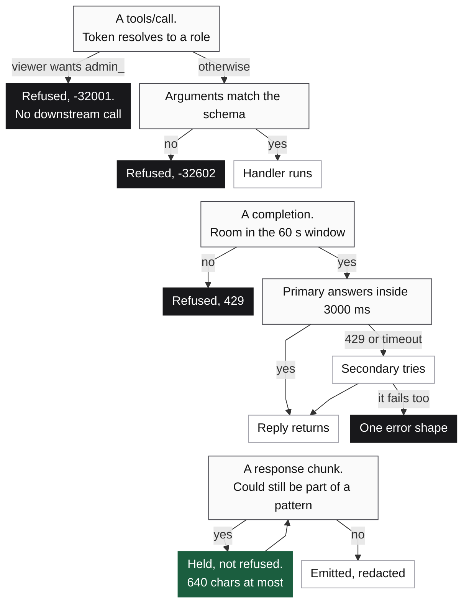

<p align="center">
  
</p>

*`make check` exits nonzero when a badge or a committed figure stops matching the report behind it.*

# Quilr FDE assessment

<p align="center">
  
  
  
</p>

- Four tasks from the brief in one project, and the hard one is task 3.
- A value to redact can arrive split across two chunks of a stream. The guardrail emits only the text that can no longer change, and holds the rest.
- Bounded patterns cap what it holds at 640 characters, whatever the response is.
- One test suite covers all four, with no network and no API key. The provider behind it is scripted on purpose, and pointing task 3 at a real one is one environment variable and one command.

## Run it

```bash
make install     # uv sync, Python 3.13
make test        # the whole suite, all four tasks
make check       # lint, claim check, figure check, then the suite
make bench       # what the task 3 guardrail costs
make run-task1   # MCP server on stdio
make run-task2   # security gateway on 8080, mock downstream on 8081
make run-task3   # streaming PII guardrail on 8082
make run-task4   # model router demo, prints every routing outcome
make run-live    # the same guardrail against a real provider, needs LLM_API_KEY
```

## What each task owns

<p align="center">
  
</p>

Where a request stops, and the one place it is only held.



`src/task1_mcp_server` puts two tools on stdio. One Pydantic model per tool does double duty as the advertised schema and the runtime check.

`src/task2_mcp_gateway` decides before it forwards. Ask it for an `admin_` tool as a viewer and the downstream never hears about it.

`src/task3_stream_guard` redacts emails, social security numbers and card numbers mid stream, including a value that arrives in two pieces.

`src/task4_model_router` is admission control plus failover, with the token budget in sqlite.

Tasks 3 and 4 both define a protocol for their provider, and `http_upstream.py` and `http_provider.py` are real implementations of it that speak the OpenAI chat completions shape. Export `LLM_API_KEY`, run `make run-live`, and a real completion streams through the same redactor. Unset, that command names the missing variable and stops.

[The four tasks](docs/TASKS.md) has the decision inside each one that is worth arguing about.

## What the guardrail costs

<p align="center">
  
</p>

A reply opening mid pattern waits for that pattern to finish arriving. The worst case doubles that. A whole
320 character match at the front, with no safe cut behind it, holds close to 640 characters before anything
leaves. That is the 53 chunks on the last bar. A longer response never costs more than that.

## What this does not prove

The brief's overview says five tasks and its body stops at four, so this repo has four.

| Number on the page | What it does not cover |
| --- | --- |
| 263 tests green | No coverage is measured, so it says what was written and nothing about what was not |
| The live provider path | Its parsing and its failures are tested, and nothing here has been run against a production provider |
| 640 char hold ceiling | Derived from the pattern lengths, and the closest witness the bench builds holds 636 |
| Every timing here | One loaded laptop against a scripted upstream, so no real provider is measured |

[The referee cards](docs/REFEREE.md) carry one card per number, saying what it measures, on what set, and what
it does not support.

## Figures and claims

No number in a figure here can go stale without a command failing.

| Command | What it does |
| --- | --- |
| `make bench` | Re-measures task 3 and writes `reports/bench_report.json` |
| `make claims` | Reruns the suite into `reports/test_report.json`, and fails when a badge above stops matching it |
| `make figures` | Redraws the three SVGs from those two reports and from the constants in `src/` |
| `make figures-check` | Redraws and compares against what is committed |

Neither one reads the prose here, which repeats some of the same numbers. Those get their accounting in the
referee cards. Re-running `make bench` re-measures, so redraw the figures after it.
