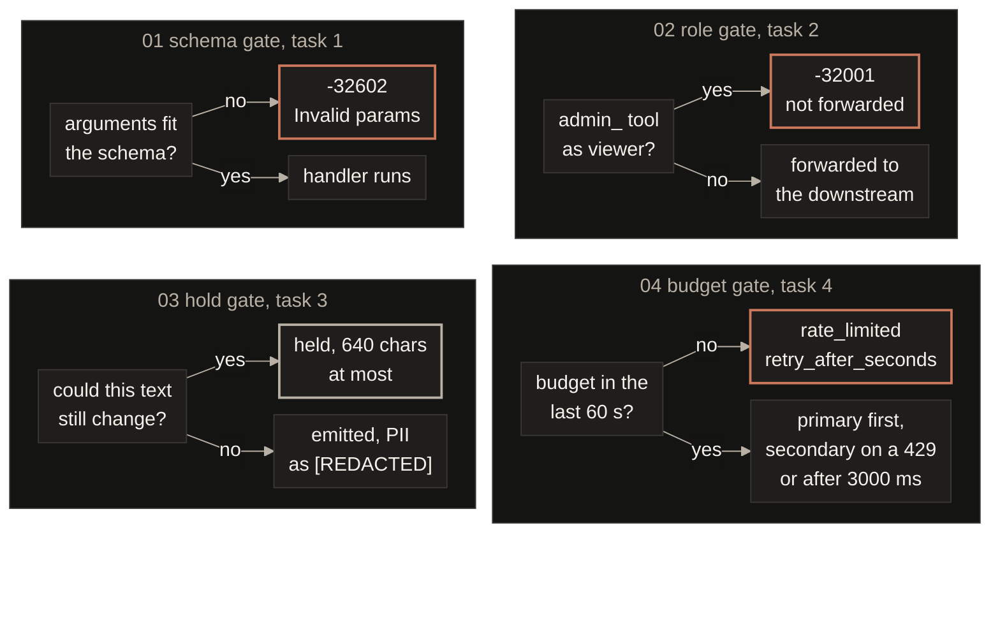
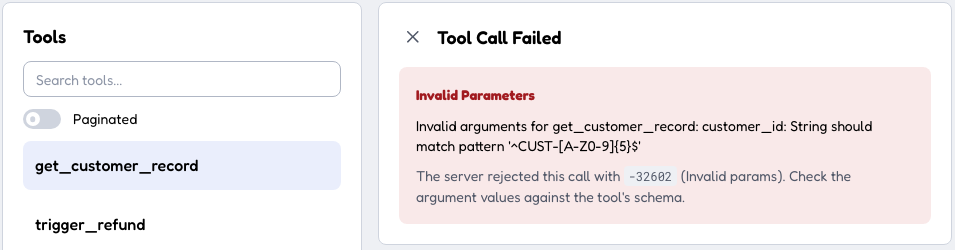
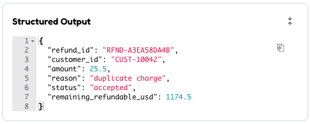

<p align="center">
  
</p>

<div align="center">

<b><font size="6">Quilr FDE assessment</font></b>

<br/>


<br/><br/>

<strong>Four tasks from the FDE brief, and one refusal per task that a test can reproduce with no network and no key.</strong><br/>
An MCP server, a security gateway, a streaming PII guardrail and a model router, on the official MCP SDK.

<br/>

<code>-32602 · -32001 · [REDACTED] · rate_limited</code>

</div>

```bash
make install     # uv sync, Python 3.13
make test        # 267 tests, no network, no key
make check       # lint, then every number on this page reread from the code and the reports
make bench       # what the task 3 guardrail costs at the first token
make run-task1   # MCP server on stdio
make run-task2   # security gateway on 8080, mock downstream on 8081
make run-task3   # streaming PII guardrail on 8082
make run-task4   # model router demo, prints every routing outcome
make run-client  # the official SDK client against task 1
make inspector   # MCP Inspector's web UI against task 1, needs npx
make run-live    # the guardrail against a real provider, needs LLM_API_KEY
```

---

## The gates, and why refusal is the unit

Each task in the brief has a place where a bad request must stop, so I built each one around that refusal and made it the thing the tests pin. A gate that says no correctly is easy to show and easy to argue about, and everything else the task does hangs off that one decision.

| | The question it answers | Where the proof is | When it says no |
|:---|:---|:---|:---|
| **Schema**, task 1 | Do the arguments fit the advertised schema? | The server run as a subprocess over stdio, with the schema and the validator checked against each other case by case | `-32602`, every bad field named at once |
| **Role**, task 2 | May this role call this tool? | The mock downstream's own request log, still empty after a viewer calls `admin_reset_key` | `-32001`, and nothing is forwarded |
| **Hold**, task 3 | Can this text still change? | `make bench`, seven openings at ten paired trials each | Held, 640 characters at most, then `[REDACTED]` |
| **Budget**, task 4 | Is there budget, and is the primary up? | One sqlite row per charge, read back by the limiter tests | `rate_limited` with a retry time, or the secondary |



## How it is built

Four small services that share a style and not a process. Task 1 speaks stdio and the gateway proxies HTTP, so in this repo the gateway's downstream is a mock server and not task 1. I would rather say that than draw an arrow the code does not have. Each tool has one Pydantic model that is both the advertised schema and the runtime validator, so the two cannot drift.

The limiter keeps every charge as one sqlite row on disk, so the 60 second window slides instead of resetting and survives a restart. The router gives the primary 3000 ms, fails over to the secondary on a 429 or a timeout, and retries nothing else.

<p align="center">
  
</p>

## The guardrail, and what it costs

The redactor emits only text that can no longer change. Every pattern has a bounded length, the longest a 320 character email at the RFC 5321 limits, so the buffer never holds more than twice that, 640 characters. A match that crosses the cut pulls the cut back to its own start, which is how `ada@exa` followed by `mple.com` becomes one `[REDACTED]`. A sweep of chunk sizes from 1 to 24 shows the answer does not depend on how the upstream splits the text.

The cost is measured, not estimated. `make bench` runs seven openings at ten paired trials each against a scripted upstream sending 12 character chunks every 10 ms. Plain prose adds under 1 ms to the first token. A 320 character email inside a longer token is the worst case at 583 ms, with 53 chunks held before the guardrail could be sure.

<p align="center">
  
</p>

## The server, and the clients it met

The SDK's `call_tool` decorator turns every exception into an `isError` result, bad arguments included. I wanted bad arguments back as a JSON-RPC `-32602`, so both handlers sit on the low level server. A missing customer still gets `isError`, because that is a domain answer. A refund checks and debits the balance in one step under a lock. Stdout is rebound to stderr before the server starts, so a stray `print` cannot break the stream.

It has met three clients. The repo's own raw stdio client reads the bytes off stdout, and the official `ClientSession` over `stdio_client` gets the same schema and the same `-32602` as an `McpError`. MCP Inspector 2.5.0 made the calls by hand through `make inspector`. The first screenshot is the refusal on purpose, `customer_id` sent as `CUST-1`, and the second is a refund for `CUST-10042` at 25.50, accepted.

<p align="center"></p>

<p align="center"></p>

## Decisions worth flagging

- The `admin_` prefix is the brief's rule and a deny list, so a privileged method under another name would sail through, and anything real gets a per method allow list.
- Admission charges four characters a token before any provider has counted, against 50,000 tokens in the trailing minute, and nothing reconciles the estimate with the bill.
- A request that produced no completion hands its tokens back, and the objection I would raise myself is that endless failures then cost nothing.
- Twenty threads racing one key win exactly ten of ten 5,000 token slots, because the loser waits on `BEGIN IMMEDIATE` rather than overspending.
- The client's bearer never reaches the downstream, the decided role travels as one header, and a downstream outage comes back as a 502 with the caller's own request id.
- Cards are checked with Luhn over runs of whole digit groups, longest first, so `4111 1111 1111 1111 123` loses the card and keeps the three digit code.

## The suite

All 267 tests, cases from 159 functions, run with no network and no key, because a scripted upstream and a scripted provider keep them deterministic. Every timing test races at 60 ms so the suite stays quick. `make claims` reruns it, rereads the constants from `src/` and the measurements from `reports/bench_report.json`, and fails when a number on this page has drifted. When it is happy it prints one line, quoted here exactly.

```
claims ok, 267 passed and 0 skipped from 159 functions, 640 chars held at most, worst first token 583 ms, Python 3.13
```

## What I left out, and why

- The 3000 ms timeout is never raced live, since every timing test runs at 60 ms, and proving the real number would need a fake clock.
- Twenty threads race the limiter and no two processes do, so the lock between separate workers is inferred from sqlite's behaviour rather than proven here.
- Task 1 has met a raw client, the SDK client and Inspector, and no host such as Claude Desktop yet.

More in [docs/TASKS.md](docs/TASKS.md), and a card for every number above in [docs/REFEREE.md](docs/REFEREE.md).
