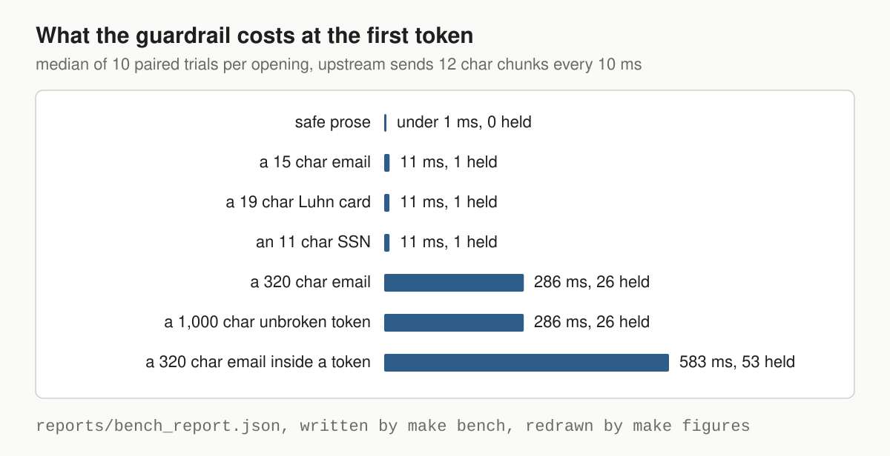
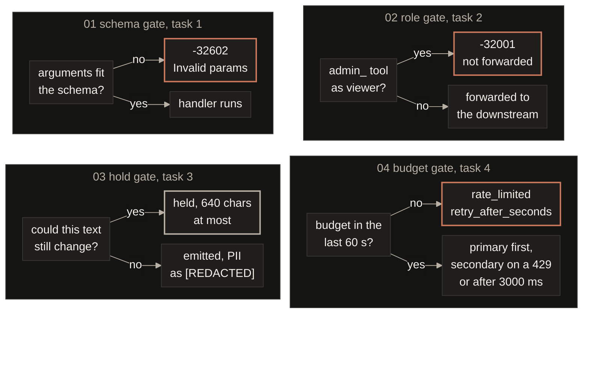
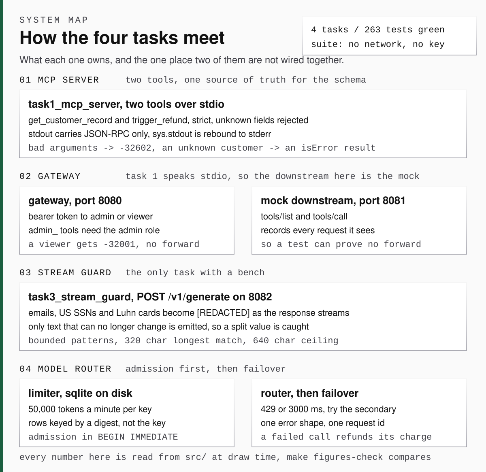

<p align="center">
  
</p>

<div align="center">

<b><font size="6">Quilr FDE assessment</font></b>

<br/>


<br/><br/>

<strong>Four tasks from the FDE brief, each one a gate, and each gate's refusal a test you can run with no network and no key.</strong><br/>
An MCP server, a security gateway, a streaming PII guardrail and a model router, on the official MCP SDK.

<br/>

<code>-32602 · -32001 · [REDACTED] · rate_limited</code>

</div>

```bash
make install     # uv sync, Python 3.13
make test        # the whole suite, all four tasks
make check       # lint, claim check, figure check, then the suite
make bench       # what the task 3 guardrail costs
make run-task1   # MCP server on stdio
make run-client  # the official SDK client against task 1, prints the exchange
make run-task2   # security gateway on 8080, mock downstream on 8081
make run-task3   # streaming PII guardrail on 8082
make run-task4   # model router demo, prints every routing outcome
make run-live    # the same guardrail against a real provider, needs LLM_API_KEY
```

---

**A bad request stops at one of four gates, and each gate has its own proof.**

| | The question it answers | Where its truth comes from | When it changes |
|:---|:---|:---|:---|
| **Schema gate**, task 1 | Do the arguments fit the advertised schema? | The server run as a subprocess over stdio, where `test_the_advertised_schema_matches_what_the_runtime_enforces` checks the schema and the validator agree on every case | When a Pydantic model changes, since one model is both |
| **Role gate**, task 2 | May this role call this tool? | The mock downstream's own request log, empty after a viewer calls `admin_reset_key`, read by `test_blocked_call_never_reaches_the_downstream_server` | When the `admin_` rule changes |
| **Hold gate**, task 3 | Can this text still change? | `make bench`, seven openings at ten paired trials each, written to `reports/bench_report.json` | When a pattern's bounded length changes |
| **Budget gate**, task 4 | Is there budget, and is the primary up? | One sqlite row per charge, read back by `tests/test_task4_rate_limiter.py` | When the window, the limit or the timeout changes |

<table>
  <tr>
    <td width="25%" align="center" valign="top"><a href="#1-the-schema-gate"><b>1. Schema</b></a><br><code>-32602 Invalid params</code><br><a href="#1-the-schema-gate">See the gate</a></td>
    <td width="25%" align="center" valign="top"><a href="#2-the-role-gate"><b>2. Role</b></a><br><code>-32001, not forwarded</code><br><a href="#2-the-role-gate">See the gate</a></td>
    <td width="25%" align="center" valign="top"><a href="#3-the-hold-gate"><b>3. Hold</b></a><br><code>640 characters at most</code><br><a href="#3-the-hold-gate">See the bench</a></td>
    <td width="25%" align="center" valign="top"><a href="#4-the-budget-gate"><b>4. Budget</b></a><br><code>rate_limited, then failover</code><br><a href="#4-the-budget-gate">See the gate</a></td>
  </tr>
</table>

---

## 1. The schema gate

Two tools over stdio, one Pydantic model each as schema and validator.

- The SDK's `call_tool` decorator turns every exception into an `isError` result, bad arguments included. I wanted `-32602`, so both handlers sit on the low level server.
- A missing customer still gets `isError`, because that is a domain answer.
- The official SDK client, `ClientSession` over `stdio_client`, completes the handshake, lists both tools with the same schema and gets `-32602` back as an `McpError`, in `tests/test_task1_sdk_client.py`.

| Step | What it has to prove before the next step may start | How it fails |
|:---|:---|:---|
| `tools/list` | The advertised schema is the model's own `model_json_schema()`, and `test_the_advertised_schema_matches_what_the_runtime_enforces` checks it against `model_validate` case by case | Two sources drift, so there is one |
| `tools/call` | Strict, so unknown fields are refused, `"12.5"` is never coerced and a sub cent amount is refused, in `test_validation_failures_map_to_invalid_params` | `-32602`, every bad field named at once |
| The refund | The balance is checked and debited in one step under a lock, in `test_a_repeated_refund_cannot_spend_the_same_balance_twice` | `isError`, with the balance in the message |
| stdout | Every line parses as one JSON-RPC message, and a forced stray `print` lands on stderr, in `test_logs_and_stray_prints_go_to_stderr` | It cannot, since `sys.stdout` is rebound to stderr |

---

## 2. The role gate

A viewer calling any `admin_` tool gets `-32001` back before the downstream hears about it.

- The `admin_` prefix is the brief's rule and a deny list. A privileged method added under another name sails through, so anything real gets a per method allow list.

| Step | What it has to prove before the next step may start | How it fails |
|:---|:---|:---|
| Bearer | The token resolves to admin or viewer, in `test_unusable_credentials_are_rejected` | 401 with `-32002`, nothing forwarded |
| Envelope | One JSON-RPC 2.0 object, and a batch is refused, in `test_malformed_envelopes_are_rejected` | 400 with `-32700` or `-32600`, nothing forwarded |
| `tools/call` | An `admin_` name needs the admin role, decided before `_forward`, in `test_viewer_is_blocked_from_admin_tools` | 200 with `-32001`, and the mock's request log stays empty, in `test_blocked_call_never_reaches_the_downstream_server` |
| Forward | The client's bearer is dropped and the decided role travels as `X-Gateway-Role`, in `test_client_bearer_token_is_not_forwarded` | 502 with `-32003` and the caller's own id when the downstream is down, in `test_a_downstream_outage_keeps_the_request_id_and_says_what_happened` |

---

## 3. The hold gate

`POST /v1/generate` streams the reply with emails, SSNs and Luhn valid cards replaced by `[REDACTED]`, split values included.

- The redactor emits only text that can no longer change. Every pattern has a bounded length, the longest a 320 character email at the RFC 5321 limits, so it never holds more than twice that, 640 characters.
- Plain prose at the front costs under 1 ms at the first token, and the 320 character email inside a longer token costs 583 ms, 53 chunks held. Both are medians of ten paired trials against a scripted upstream.

| Step | What it has to prove before the next step may start | How it fails |
|:---|:---|:---|
| Cut | Anything further back than 320 characters is settled, and inside that window the cut walks back to the nearest prose space, in `test_nothing_is_emitted_before_it_is_settled` | Held, never emitted early |
| Match | A match crossing the cut pulls the cut back to its own start, so `ada@exa` then `mple.com` is one `[REDACTED]`, and `test_every_chunk_size_gives_the_same_answer` sweeps chunk sizes 1 to 24 | Held until it resolves, 640 characters at most |
| Card | Luhn over runs of whole groups, longest first, so `4111 1111 1111 1111 123` loses the card and keeps the code, in `test_a_card_beside_other_digits_is_still_redacted` | A run that fails Luhn is left alone, in `test_card_failing_luhn_is_left_alone` |
| Flush | The held tail leaves when the upstream ends, in `test_a_value_at_the_very_end_is_redacted_by_the_flush` | Nothing stays in the buffer |



| First token record, `make bench` | Chunks held | The guardrail adds | Range over ten pairs |
|:---|:---|:---|:---|
| Safe prose | 0 | under 1 ms | -1 to 1 ms |
| A 15 char email | 1 | 11 ms | 10 to 16 ms |
| A 19 char Luhn card | 1 | 11 ms | 10 to 11 ms |
| An 11 char SSN | 1 | 11 ms | 10 to 15 ms |
| A 320 char email | 26 | 286 ms | 282 to 287 ms |
| A 1,000 char unbroken token | 26 | 286 ms | 283 to 288 ms |
| A 320 char email inside a token | 53 | 583 ms | 580 to 586 ms |

---

## 4. The budget gate

Every charge is one sqlite row on disk, so the window slides, and a 429 or a timeout on the primary fails over.

- A request that produced no completion hands its tokens back rather than spending the tenant's next minute. The objection is that endless failures then cost nothing, and production would count them against an abuse budget.

| Step | What it has to prove before the next step may start | How it fails |
|:---|:---|:---|
| Admit | The estimate, prompt characters over four plus the output budget, fits under 50,000 tokens in the trailing 60 seconds, in `test_the_window_boundary_is_exact` | `rate_limited` with `retry_after_seconds`, and no provider is called, in `test_exhausting_the_budget_returns_a_429_payload_and_calls_nobody` |
| Race | Twenty threads on one key win exactly ten of ten 5,000 token slots, in `test_concurrent_requests_against_one_key_cannot_overspend` | The loser waits on `BEGIN IMMEDIATE` rather than overspending |
| Primary | Answers inside 3000 ms without a 429, raced at 60 ms in `test_the_timeout_races_the_response_rather_than_always_firing` | The secondary, in `test_failover_on_a_429` and `test_failover_on_a_timeout`, and nothing else is retried, in `test_an_unexpected_provider_error_is_not_failed_over` |
| Error | One payload with a fixed message and a request id, in `test_error_payloads_leak_no_upstream_detail` | `upstream_unavailable`, and the charge is released, in `test_a_request_that_produced_nothing_does_not_spend_the_budget` |

---

## The four tasks, as a map

Each gate as a lane, and no arrow from the role gate into the schema gate, because task 1 speaks stdio and the gateway's downstream in this repo is the mock.

<!-- mermaid:start, drawn by tools/draw_figures.py, edit the generator -->

<!-- mermaid:end -->



`tools/draw_figures.py` draws every figure above from the constants in `src/` and the two reports under `reports/`, and `make figures-check` goes red when a committed file drifts from its generator.

## Recounted on every `make check`

`make claims` runs the suite, rereads the constants from `src/` and the measurements from `reports/bench_report.json`, and fails when a badge, a record row or a sentence above has drifted.

```
claims ok, 267 passed and 0 skipped from 159 functions, 640 chars held at most, worst first token 583 ms, Python 3.13
```

## What I left out, and why

- All 267 tests, cases from 159 functions, run with no network and no key, because the scripted upstream and provider keep them deterministic.
- Every timing test runs at 60 ms to stay quick, so the 3000 ms timeout is never raced live, and the real number would need a fake clock.
- Admission runs before any provider has counted, so the limiter charges four characters a token and nothing reconciles the estimate against the bill.
- Twenty threads race the limiter and no two processes do, because each thread holds its own connection, so the lock between workers is inferred, not proven.
- Task 1 has met this repo's raw stdio client, the official SDK client in `tests/test_task1_sdk_client.py`, and no host such as Claude Desktop yet.

More in [docs/REFEREE.md](docs/REFEREE.md).
