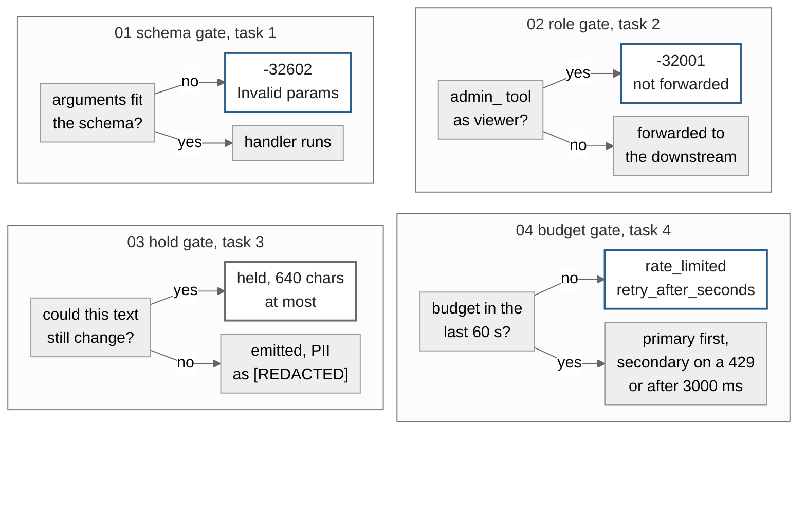

<p align="center">
  
</p>

<div align="center">

<b><font size="6">Quilr FDE assessment</font></b>

<br/>


<br/><br/>

<strong>Four tasks from the FDE brief. Each one has a place where it refuses a request, and each refusal is a test you can run with no network and no key.</strong><br/>
An MCP server, a security gateway, a streaming PII guardrail and a model router, on the official MCP SDK.

<br/>

<code>-32602 · -32001 · [REDACTED] · rate_limited</code>

</div>

```bash
make install     # uv sync, Python 3.13
make test        # the whole suite, all four tasks
make check       # lint, claim check, figure check, then the suite
make bench       # what the task 3 guardrail costs
make run-task1   # MCP server on stdio
make run-client  # the official SDK client against task 1, prints the exchange
make inspector   # MCP Inspector's web UI against task 1, needs npx
make run-task2   # security gateway on 8080, mock downstream on 8081
make run-task3   # streaming PII guardrail on 8082
make run-task4   # model router demo, prints every routing outcome
make run-live    # the same guardrail against a real provider, needs LLM_API_KEY
```

---

A bad request stops at one of four gates, and each gate has its own proof.

| Gate | The question it answers | Where the proof is | What would change it |
|:---|:---|:---|:---|
| Schema, task 1 | Do the arguments fit the advertised schema? | The server run as a subprocess over stdio, where `test_the_advertised_schema_matches_what_the_runtime_enforces` checks the schema and the validator agree on every case | A Pydantic model, since one model is both |
| Role, task 2 | May this role call this tool? | The mock downstream's own request log, empty after a viewer calls `admin_reset_key`, read by `test_blocked_call_never_reaches_the_downstream_server` | The `admin_` rule |
| Hold, task 3 | Can this text still change? | `make bench`, seven openings at ten paired trials each, written to `reports/bench_report.json` | A pattern's bounded length |
| Budget, task 4 | Is there budget, and is the primary up? | One sqlite row per charge, read back by `tests/test_task4_rate_limiter.py` | The window, the limit or the timeout |

---

## 1. The schema gate

Two tools over stdio, `get_customer_record` and `trigger_refund`. Each has one Pydantic model that is both the advertised schema and the runtime validator, so the two cannot drift, and `test_the_advertised_schema_matches_what_the_runtime_enforces` checks the JSON schema and the validator agree on every case.

The SDK's `call_tool` decorator turns every exception into an `isError` result, bad arguments included. I wanted bad arguments to come back as a JSON-RPC `-32602`, so both handlers sit on the low level server instead. The models are strict, so an unknown field is refused, the string `"12.5"` is never coerced to a number, and a refund of less than a cent is refused, with every bad field named at once. A missing customer still gets `isError`, because that is a domain answer and not a malformed request.

A refund checks the balance and debits it in one step under a lock, so a repeated call cannot spend the same balance twice. The server also rebinds `sys.stdout` to stderr before it starts, so a stray `print` from anywhere lands on stderr and every line on stdout parses as one JSON-RPC message.

I ran it against three clients. The repo's own raw stdio client in the tests reads the bytes off stdout. The official SDK client, `ClientSession` over `stdio_client`, completes the handshake, lists both tools with the same schema and gets the `-32602` back as an `McpError`, in `tests/test_task1_sdk_client.py`. And MCP Inspector 2.5.0, started with `make inspector`, connected over stdio and made the same calls by hand. Both screenshots below are from that session.

The first one is the refusal, on purpose. I sent `customer_id` as `CUST-1`, which fails the `CUST-XXXXX` pattern, so the server answered `-32602` and Inspector shows it as a failed call.


The second is a refund for `CUST-10042` at 25.50, accepted, with the balance that remains.


---

## 2. The role gate

A viewer calling any `admin_` tool gets `-32001` back before the downstream hears about it. The bearer token resolves to admin or viewer first, and a token that fails to resolve gets a 401, in `test_unusable_credentials_are_rejected`. The body has to be one JSON-RPC 2.0 object, so a batch or a malformed envelope gets a 400 without being forwarded, in `test_malformed_envelopes_are_rejected`.

The role check runs before anything is forwarded, in `test_viewer_is_blocked_from_admin_tools`, and the proof that nothing leaked is the mock downstream's own request log, which is still empty after a viewer calls `admin_reset_key`, in `test_blocked_call_never_reaches_the_downstream_server`. On the way through, the client's bearer is dropped and the decided role travels as an `X-Gateway-Role` header, in `test_client_bearer_token_is_not_forwarded`. When the downstream is down the caller gets a 502 with `-32003` and its own request id, in `test_a_downstream_outage_keeps_the_request_id_and_says_what_happened`.

One thing I would not ship as is. The `admin_` prefix is the brief's rule, and it is a deny list, so a privileged method added under another name would sail through. Anything real gets a per method allow list.

---

## 3. The hold gate

`POST /v1/generate` on 8082 streams the model's reply with emails, US social security numbers and Luhn valid card numbers replaced by `[REDACTED]`, including a value that arrives split across two chunks.

The redactor only emits text that can no longer change. Anything further back than the longest possible match is settled, and inside that window the cut walks back to the nearest space, in `test_nothing_is_emitted_before_it_is_settled`. Every pattern has a bounded length, and the longest is a 320 character email at the RFC 5321 limits, so the buffer never holds more than twice that, 640 characters. A match that crosses the cut pulls the cut back to its own start, which is how `ada@exa` followed by `mple.com` becomes one `[REDACTED]`, and `test_every_chunk_size_gives_the_same_answer` sweeps chunk sizes from 1 to 24 to show the answer does not depend on how the upstream happens to split the text. Cards are checked with Luhn over runs of whole digit groups, longest first, so `4111 1111 1111 1111 123` loses the card and keeps the three digit code, and a run that fails Luhn is left alone. Whatever is still held when the upstream ends is flushed through the same path, so a value at the very end is redacted too.

What it costs is measured, not estimated. `make bench` runs seven openings at ten paired trials each against a scripted upstream that sends 12 character chunks every 10 ms, and writes the medians and ranges to `reports/bench_report.json`. Plain prose at the front adds under 1 ms to the first token. A 320 character email inside a longer token is the worst case at 583 ms, with 53 chunks held before the guardrail could be sure. The chart and the table below are drawn from that report.


| Opening, from `make bench` | Chunks held | The guardrail adds | Range over ten pairs |
|:---|:---|:---|:---|
| Safe prose | 0 | Under 1 ms | -1 to 1 ms |
| A 15 char email | 1 | 11 ms | 10 to 16 ms |
| A 19 char Luhn card | 1 | 11 ms | 10 to 11 ms |
| An 11 char SSN | 1 | 11 ms | 10 to 15 ms |
| A 320 char email | 26 | 286 ms | 282 to 287 ms |
| A 1,000 char unbroken token | 26 | 286 ms | 283 to 288 ms |
| A 320 char email inside a token | 53 | 583 ms | 580 to 586 ms |

---

## 4. The budget gate

Every charge is one sqlite row on disk, so the 60 second window slides instead of resetting, and it survives a restart. A request is admitted if its estimate, the prompt length at four characters a token plus the output budget, fits under 50,000 tokens in the trailing window, in `test_the_window_boundary_is_exact`. Otherwise the caller gets `rate_limited` with a `retry_after_seconds` and no provider is called, in `test_exhausting_the_budget_returns_a_429_payload_and_calls_nobody`. Twenty threads racing one key win exactly ten of ten 5,000 token slots, in `test_concurrent_requests_against_one_key_cannot_overspend`, because the loser waits on `BEGIN IMMEDIATE` rather than overspending.

The primary has 3000 ms to answer. A 429 or a timeout fails over to the secondary, in `test_failover_on_a_429` and `test_failover_on_a_timeout`, and any other provider error is not retried, in `test_an_unexpected_provider_error_is_not_failed_over`. The timeout test races at 60 ms so the suite stays quick. Errors reach the caller as one payload with a fixed message and a request id, and never the upstream's text, in `test_error_payloads_leak_no_upstream_detail`.

A request that produced no completion hands its tokens back rather than spending the tenant's next minute, in `test_a_request_that_produced_nothing_does_not_spend_the_budget`. The objection I would raise myself is that endless failures then cost nothing, and production would count them against a separate abuse budget.

---

## The four tasks, as a map

Each gate as a lane, and no arrow from the role gate into the schema gate, because task 1 speaks stdio and the gateway's downstream in this repo is the mock.




`tools/draw_figures.py` draws every figure above from the constants in `src/` and the two reports under `reports/`, and `make figures-check` goes red when a committed file drifts from its generator.

## Checking the numbers on this page

`make claims` runs the suite, rereads the constants from `src/` and the measurements from `reports/bench_report.json`, and fails if a badge, a table row or a number in a sentence above has drifted. It prints one line when it is happy, and the page has to quote that line exactly.

```
claims ok, 267 passed and 0 skipped from 159 functions, 640 chars held at most, worst first token 583 ms, Python 3.13
```

## What I left out, and why

- All 267 tests, cases from 159 functions, run with no network and no key, because the scripted upstream and provider keep them deterministic, so nothing here has been measured against a real model's timing.
- Every timing test runs at 60 ms to stay quick, so the 3000 ms timeout is never raced live, and proving the real number would need a fake clock.
- Admission runs before any provider has counted tokens, so the limiter charges four characters a token and nothing reconciles the estimate against the bill.
- Twenty threads race the limiter and no two processes do, because each thread holds its own connection, so the lock between separate workers is inferred from sqlite's behaviour rather than proven here.
- Task 1 has met this repo's raw stdio client, the official SDK client in `tests/test_task1_sdk_client.py`, and MCP Inspector by hand, and no host such as Claude Desktop yet.

There is more on each number, where it comes from and what would move it, in [docs/REFEREE.md](docs/REFEREE.md).
